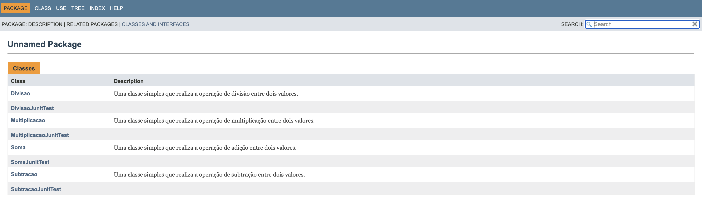
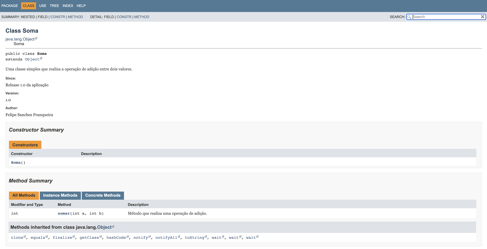
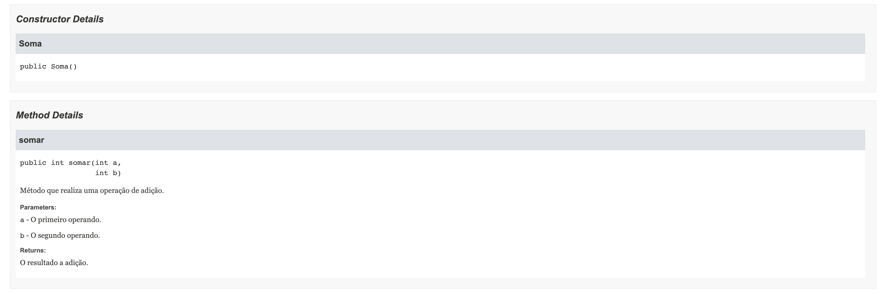

# Testes Automatizados (CALCULADORA)
## Descrição
Este projeto visa testar as quatro operações basicas de uma calculadora,
soma, subtração, divisão e multiplicação, utilizando o <em>framework</em> JUnit. 
Cada operação tem a sua respetiva classe contendo o método que realiza o seu cálculo 
matemático, tendo tambem outra classe destinada aos testes automatizados utilizando JUnit 
com possíveis casos previstos daquela operação.

## Classes das Operações
As classes das operações tem o nome da operação e um unico método publico
que realiza o cálculo e retorna um valor do tipo int. Todas as classes das operações 
foram documentadas utilizando JavaDoc. Segue o exemplo da classe `Soma`

## Classes dos Teste com JUnit
As classes de testes são onde são feitos os testes automatizados, utilizando JUnit,
dos metodos das classes das operações, cada operação tem a sua classe de testes. 
Segue o exemplo da classe `SomaJunitTest`

## Documentação
Abaixo está algumas imagens mostrando a página da documentação

## Ultima atulização 07/11/2023